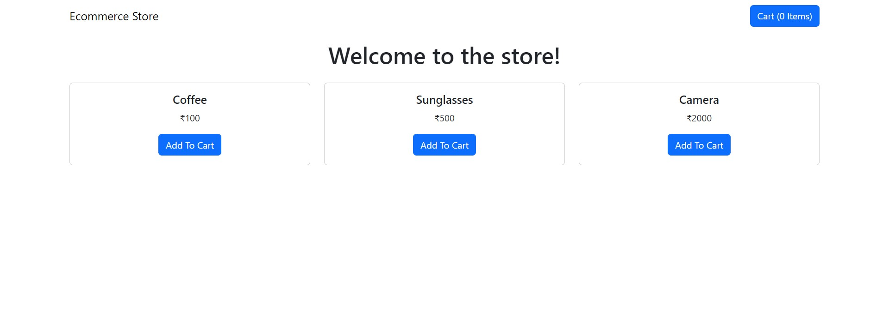
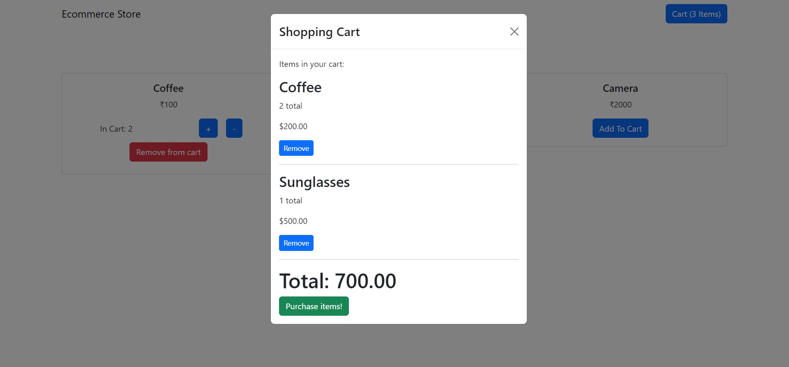
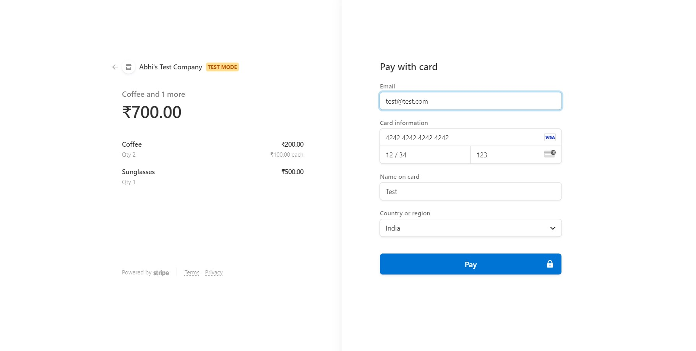

# Screenshots

# Description

- A full stack ecommerce site boilerplate setup with Stripe integration for payments.
- Ability to add products in cart, vary quantity, setup payments, etc.

# Instructions

- Clone repository from '(https://github.com/abhi-j0407/ecommerce-simple.git)'
- Change directory to project folder, and run 'npm install' in terminal to install the required dependencies, do the same inside store folder for frontend dependencies.
- To run project, run command 'npm start' in root, as well as in store folder.
